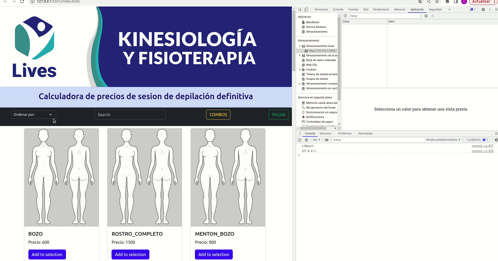

# PreEntrega3-Aguada
Segunda pre entrega del curso de javascrip dictado por Coder House. Comisión: 47045

Implementaciones respecto a la consigna.
- Uso de JSON y STORGE: se usa para almacenar las variables globales del sistema como son:
    - validZones
    - validCombos
    - selectedZones
- Uso de DOM y detección de eventos: Todos los ingresos que se realizaban antes por promt y la información que se mostraba por alerts,
ahora se ingresan por interacción con botones o inputs y se visualizan mediante estilos y otras interacciones.

## Funcionamiento.

-Estado de las zonas: Si seleccionamos una zona, pulsando en el boton de agregar, cambia su estado y queda seleccionada.
    Esto se ve reflejado en el storage. Y si recargo la página, se mantine este estado.

    

# PreEntrega2-Aguada
Segunda pre entrega del curso de javascrip dictado por Coder House. Comisión: 47045

Antes que nada, señalo que los detalles de la primera pre-entrega quedaron debajo.

Implementaciones respecto a la consigna.
- La totalidad de los procesos contenidos en funciones.
- Funciones generales para reutilizarlas.
- Creacion de objetos: constructores e instanciaciones.
- Uso de métodos de clase.
- Se mejoró la performance del código al menos variables auxiliares.
- Uso de metodos de listas:
    - map()
    - splice()
    - sort()
    - slice()
    - indexOf
    - find()

# PreEntrega1-Aguada
Primera pre entrega del curso de javascrip dictado por Coder House. Comisión: 47045

# Simulador interactivo
## Aspectos a incluir

Archivo HTML y Archivo JS, referenciado en el HTML por etiqueta ``, que incluya la definición de un algoritmo en JavaScript que emplee funciones para resolver el procesamiento principal del simulador

## Ejemplo

Calcular costo total de productos y/o servicios seleccionados por el usuario.
Calcular pagos en cuotas sobre un monto determinado.
Calcular valor final de un producto seleccionado en función de impuestos y descuentos.
Calcular tiempo de espera promedio en relación con la cantidad de turnos registrados.
Calcular edad promedio de personas registradas.
Calcular nota final de alumnos ingresados.

## Sugerencias

Algunos criterios a tener en cuenta para seleccionar un proceso a simular por primera vez son: 
“ELEGIR UN PROCESO BIEN CONOCIDO”: Si conozco una situación que implique adquirir cierta información y estoy bien familiarizado en “cómo se hace”, es más fácil traducir la solución a un lenguaje de programación.
“ELEGIR UN PROCESO QUE ME RESULTE INTERESANTE”: Si me siento motivado sobre el tema, es más llevadero enfrentar los retos de desarrollo e interpretación. Antes de programar existe la etapa de relevamiento y análisis que me permite identificar cómo solucionar el proceso.